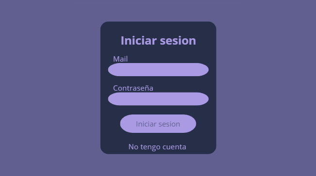
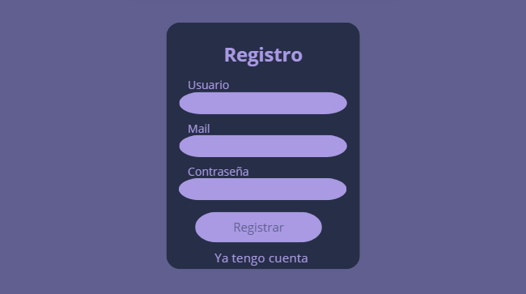
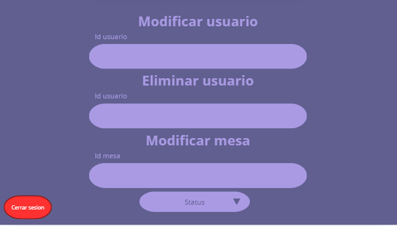
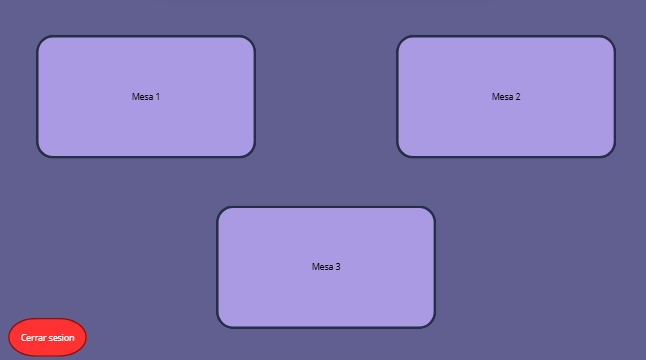
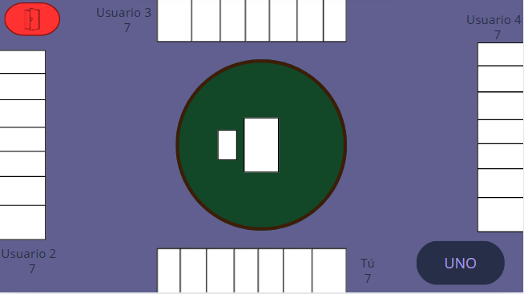
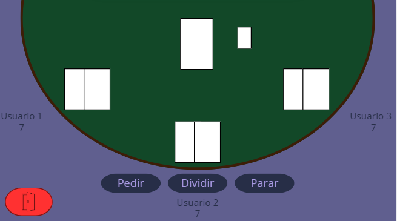

# 2025-TPIN-2-G12

## Proyecto interdisciplinario
## Segundo cuatrimestre

***Título de la propuesta: Carteados***
*Grupo: 12 División: 5°B Informática*   

Integrantes:
* Paula Chong
* Morena Vega
* Gianfranco Pallavicini
* Sebastián Gil Fernández

### Descripción de la propuesta

La propuesta del proyecto es un espacio virtual con mesas en las que se puedan jugar distintos juegos de cartas como el UNO o El Blackjack.

### Bocetos de la interfaz de la aplicación

### Alcance:
- Multijugador
- Mesas Limitadas
- Sistema de Turnos (Sin temporizador)

### Tareas:
1. Base de Datos
2. Diseño de imagen y de la UI
3. Login y Registro
4. Sistema de turnos (Sin temporizador)
5. Funcionamiento de mesas
6. Usuario Administrador
7. Mecánicas del Juego
8. HTML y JS (Front)
9. CSS
10. Componentes

### Responsabilidades:

* 1. 2. 6. MV
* 2. 9. 10. PC
* 3. 7. 6. 5. SGF
* 4. 5. 8. 7. GP

### Diagrama Gantt

A insertar

### Primer entregable: Login y Registro (16/10):

Para este momento; se debería poder entrar a la página mediante el ingreso de un usuario y su contraseña. Esto implicaría la creación del proyecto en sí; la creación de la tabla Usuarios (como mínimo), la página creada con las funciones de fetch aplicadas y el estilo definido.

### Segundo entregable: Usuario Administrador (20/10):

Ahora debería poderse manipular los usuarios y la base de datos por medio de una pagina específicamente diseñada; esta será capaz de: 
- Eliminar Usuarios
- Modificar el estado (Deshabilitar o cambiar de juego) de las mesas
- Modificar Usuarios

### Tercer entregable: Sistema de Turnos (Sin Temporizador) (23/10):

En este punto, debería estar armada por lo menos una mesa y ser funcional el sistema de turnos del juego. Esto implicaría que cada usuario pueda ejecutar su jugada en un momento determinado

### Cuarto entregable: Uno (31/10):

Ahora deberían estar armadas las mecánicas, la configuración y el estilo necesario para poder jugar al Uno. El usuario debería ser capaz de ingresar a la mesa y poder jugar con otros 3 (máx) por turnos

### Entrega final

### ***Copyright Matievfull Demango 2024-2025***
